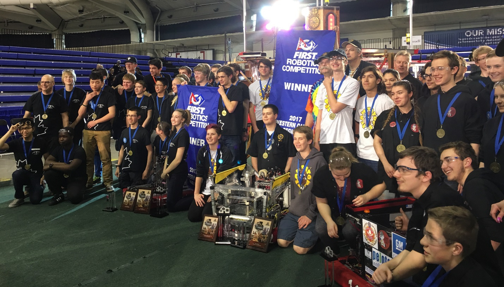

<!DOCTYPE html>
<html lang="en">

<head>
<title>Team 4334 - Western Canada 2017</title>
<meta charset="utf-8">
<meta content="width=device-width, initial-scale=1" name="viewport">
<link href="../../resources/css/bootstrap.min.css" rel="stylesheet">

<link href="../../favicon.ico" rel="icon" type="image/png">
</head>

<body>

<nav class="navbar navbar-default">
	

		

			<button class="navbar-toggle" data-target="#myNavbar" data-toggle="collapse" type="button">
			
			</button>
		

		

			<ul class="nav navbar-nav navbar-right">
				<li><a href="../../index.html" id="heightfix">Home</a></li>
				<li class="dropdown">
				<a class="dropdown-toggle" data-toggle="dropdown" href="#" style="font-style: italic" id="heightfix">
				FIRST </a>
				<ul class="dropdown-menu">
					<li>
					<a href="../../first/first.html" style="font-style: italic;">FIRST</a></li>
					<li><a href="../../first/sw2017.html">Steamworks 2017</a></li>
					<li><a href="../../first/sh2016.html">Stronghold 2016</a></li>
					<li><a href="../../first/rr2015.html">Recycle Rush 2015</a></li>
					<li><a href="../../first/aa2014.html">Aerial Assist 2014</a></li>
					<li><a href="../../first/ua2013.html">Ultimate Ascent 2013</a></li>
					<li><a href="../../first/rr2012.html">Rebound Rumble 2012</a></li>
				</ul>
				</li>
				<li><a href="../../team/team.html" id="heightfix">Team</a></li>
				<li><a href="../blog/blog.html" id="heightfix">Blog</a></li>
				<li><a href="../../media/photos.html" id="heightfix">Media</a></li>
				<li><a href="../../sponsors.html" id="heightfix">Sponsors</a></li>
				<li><a href="../../contact.html" id="heightfix">Contact</a></li>
			</ul>
		

	

</nav>

<h1 style="margin-top:10px; float:left">Western Canada 2017</h1>
<a href="../blog.html">
<< Back to Blog
</a>

April 7, 2017

Team 4334, Alberta Tech Alliance participated in the 2017 Western Canada Regional this weekend against over 48 amazing teams. 4334 finished 13th seed in the qualification round with a record of 12-3-0. In the draft stage, 2122, Team Tators invited us and team 1482, the Ghosts to join their alliance. The three teams went undefeated in the elimination matches to claim victory with a new regional high score of 422 points. ATA also took home the Quality Award sponsored by Motorola Solutions Foundation.

</body>

</html>
