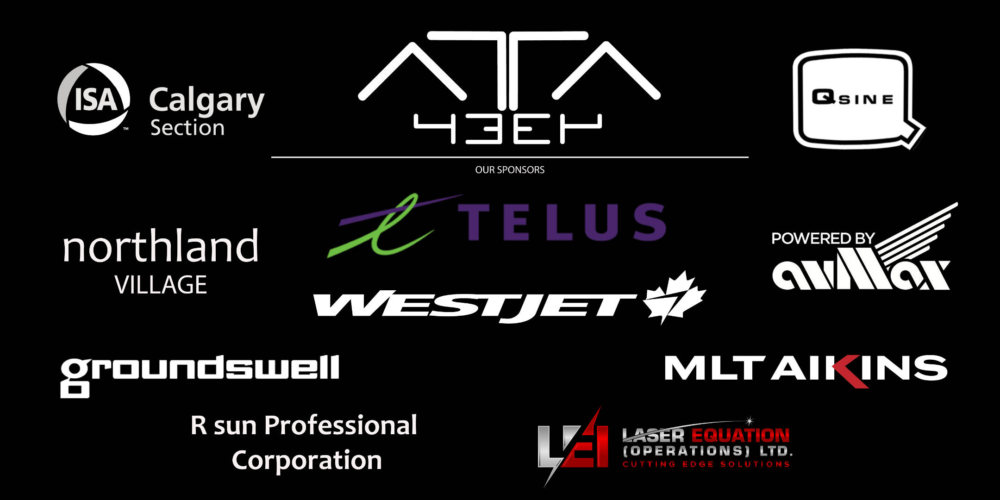

<!DOCTYPE html>
<html lang="en">

<head>
<title>Team 4334 - Sponsors</title>
<meta charset="utf-8">
<meta content="width=device-width, initial-scale=1" name="viewport">
<link href="resources/css/bootstrap.min.css" rel="stylesheet">

<link href="favicon.ico" rel="icon" type="image/png">
</head>

<body>

<nav class="navbar navbar-default">
	

		

			<button class="navbar-toggle" data-target="#myNavbar" data-toggle="collapse" type="button">
			
			</button>
		

		

			<ul class="nav navbar-nav navbar-right">
				<li><a id="heightfix" href="index.html">Home</a></li>
				<li class="dropdown">
				<a id="heightfix" class="dropdown-toggle" data-toggle="dropdown" href="#" style="font-style: italic">
				FIRST </a>
				<ul class="dropdown-menu">
					<li><a href="first/first.html" style="font-style: italic;">FIRST</a></li>
					<li><a href="first/sw2017.html">Steamworks 2017</a></li>
					<li><a href="first/sh2016.html">Stronghold 2016</a></li>
					<li><a href="first/rr2015.html">Recycle Rush 2015</a></li>
					<li><a href="first/aa2014.html">Aerial Assist 2014</a></li>
					<li><a href="first/ua2013.html">Ultimate Ascent 2013</a></li>
					<li><a href="first/rr2012.html">Rebound Rumble 2012</a></li>
				</ul>
				</li>
				<li><a id="heightfix" href="team/team.html">Team</a></li>
				<li><a id="heightfix" href="blog/blog.html">Blog</a></li>
				<li><a id="heightfix" href="media/photos.html">Media</a></li>
				<li><a id="heightfix" href="sponsors.html">Sponsors</a></li>
				<li><a id="heightfix" href="contact.html">Contact</a></li>
			</ul>
		

	

</nav>

	

		

			<h1 style="margin-top: 10px">Sponsors</h1>
			
Our sponsors are an essential piece of our success. They provide 
			the capacity that allows us to thrive. We’re always thankful for our 
			past and present sponsors.

			
You can help our students pursue an interest in science, technology, 
			engineering, and math by sponsoring out team.

			
Please email us at
			<a href="mailto:team@4334.ca?Subject=Team%20Inqury" target="_top">team@4334.ca</a> 
			if you wish to become a sponsor.

			

				<a class="btn btn-info" href="resources/pdf/Sponsorship%20Package%202017-2018.pdf" role="button" style="background: #404040; border-radius: 0px; color: white; margin-top: 0px; margin-bottom: 15px">
				Sponsorship Information</a> 

		

	

	

		

			<h1>Current Sponsors</h1>
			

			

			<!-- Image Map Generated by http://www.image-map.net/ -->
			
			<map name="image-map">
				<area alt="Avmax" coords="413,744,28,536" href="http://www.avmax.com/" shape="rect" target="" title="Avmax">
				<area alt="MaxField" coords="201,749,827,985" href="http://maxfield.ca/" shape="rect" target="" title="MaxField">
				<area alt="Bishop Carroll High School" coords="846,751,1051,1044" href="https://www.cssd.ab.ca/schools/bishopcarroll/Pages/default.aspx" shape="rect" target="" title="Bishop Carroll High School">
				<area alt="Ecoquip" coords="1110,751,1646,982" href="http://www.ecoquip.ca/" shape="rect" target="" title="Ecoquip">
				<area alt="Laser Equation" coords="1375,595,1900,739" href="http://www.laserequation.com/" shape="rect" target="" title="Laser Equation">
				<area alt="Gibsons" coords="1532,281,1880,472" href="http://www.gibsons.com/" shape="rect" target="" title="Gibsons">
				<area alt="Lexus of Calgary" coords="1473,66,1795,239" href="http://www.lexusofcalgary.com/" shape="rect" target="" title="Lexus of Calgary">
				<area alt="MLT Aikins" coords="520,58,1402,210" href="https://www.mltaikins.com/" shape="rect" target="" title="MLT Aikins">
				<area alt="Qsine" coords="123,32,454,290" href="http://qsine.ca/" shape="rect" target="" title="Qsine">
				<area alt="Sentio Engineering" coords="79,326,357,475" href="http://www.sentio.ca/" shape="rect" target="" title="Sentio Engineering">
			</map>
		

		
	

</body>

</html>
