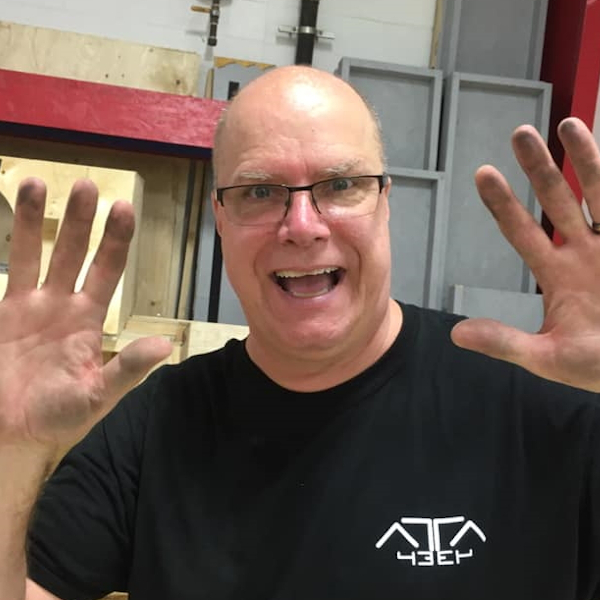

<!DOCTYPE html>
<html lang="en">

<head>
<title>Team 4334 - Mentors</title>
<meta charset="utf-8">
<meta content="width=device-width, initial-scale=1" name="viewport">
<link href="../resources/css/bootstrap.min.css" rel="stylesheet">

<link href="../favicon.ico" rel="icon" type="image/png">
</head>

<body>

<nav class="navbar navbar-default">
	

		

			<button class="navbar-toggle" data-target="#myNavbar" data-toggle="collapse" type="button">
			
			</button>
		

		

			<ul class="nav navbar-nav navbar-right">
				<li><a href="../index.html" id="heightfix">Home</a></li>
				<li class="dropdown">
				<a class="dropdown-toggle" data-toggle="dropdown" href="#" style="font-style: italic" id="heightfix">
				FIRST </a>
				<ul class="dropdown-menu">
					<li>
					<a href="../first/first.html" style="font-style: italic;">FIRST</a></li>
					<li><a href="../first/sw2017.html">Steamworks 2017</a></li>
					<li><a href="../first/sh2016.html">Stronghold 2016</a></li>
					<li><a href="../first/rr2015.html">Recycle Rush 2015</a></li>
					<li><a href="../first/aa2014.html">Aerial Assist 2014</a></li>
					<li><a href="../first/ua2013.html">Ultimate Ascent 2013</a></li>
					<li><a href="../first/rr2012.html">Rebound Rumble 2012</a></li>
				</ul>
				</li>
				<li><a href="../team/team.html" id="heightfix">Team</a></li>
				<li><a href="../blog/blog.html" id="heightfix">Blog</a></li>
				<li><a href="../media/photos.html" id="heightfix">Media</a></li>
				<li><a href="../sponsors.html" id="heightfix">Sponsors</a></li>
				<li><a href="../contact.html" id="heightfix">Contact</a></li>
			</ul>
		

	

</nav>

	<nav id="snav" class="navbar navbar-inverse">
		

			

				<a class="navbar-brand" style="font-size: 24pt">Mentors</a>
			

			<ul class="nav navbar-nav navbar-right">
				<li><a href="team.html">Team</a></li>
				<li><a href="history.html">History</a></li>
				<li><a href="awards.html">Awards</a></li>
				<li><a href="robots.html">Robots</a></li>
				<li class="active"><a href="mentors.html">Mentors</a></li>
				<li><a href="alumni.html">Alumni</a></li>
			</ul>
		

	</nav>

	

		

			

				
				<h3 style="padding-left: 5px">Mac Hunik</h3>
				
Mac Hunik is a previous team member. He is now studying as a mechanical engineer.

				
Mac supports the team as a: -Fabrication Mentor -Drive Coach

			

		

		

			

				
				<h3 style="padding-left: 5px">Alex Vu</h3>
				
Alex Vu is a previous team member. He is now studying as a neuroscientist for some reason.

				
Alex supports the team as a: -CAD Mentor -Design Mentor

			

		

		

			

				
				<h3 style="padding-left: 5px">Cole Batonyi</h3>
				
Cole Batonyi is a previous team member. He is now studying as a mechanical engineer.

				
Cole supports the team as a: -CAD Mentor -Design Coach

			

		

	

	

		

			

				
				<h3 style="padding-left: 5px">Louis Batonyi</h3>
				
Louis supports the team as a: -Lead Mentor -Mechanical Mentor

			

		

		

			

				
				<h3 style="padding-left: 5px">Joel Gallant</h3>
				
Joel Gallant is a previous team member.

				
Joel supports the team as a: -Lead Mentor -Programming Mentor

			

		

		

			

				
				<h3 style="padding-left: 5px">Clayton McNeil</h3>
				
Clayton McNeil is a previous team member.

				
Clayton supports the team as a: -CAD Mentor -Electronics Mentor

			

		

	

	

		

			

				
				<h3 style="padding-left: 5px">Jeremy Zantua</h3>
				
Jeremy Zantua is a previous team member.

				
Jeremy supports the team as a: -CAD Mentor

			

		

		

		

		

		

	

</body>

</html>
